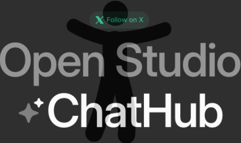
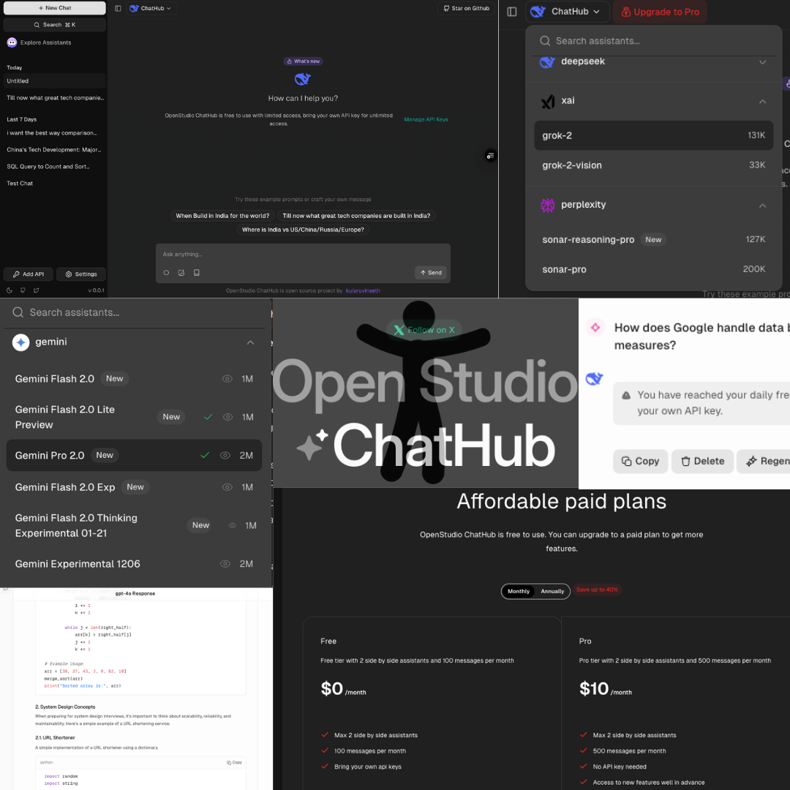
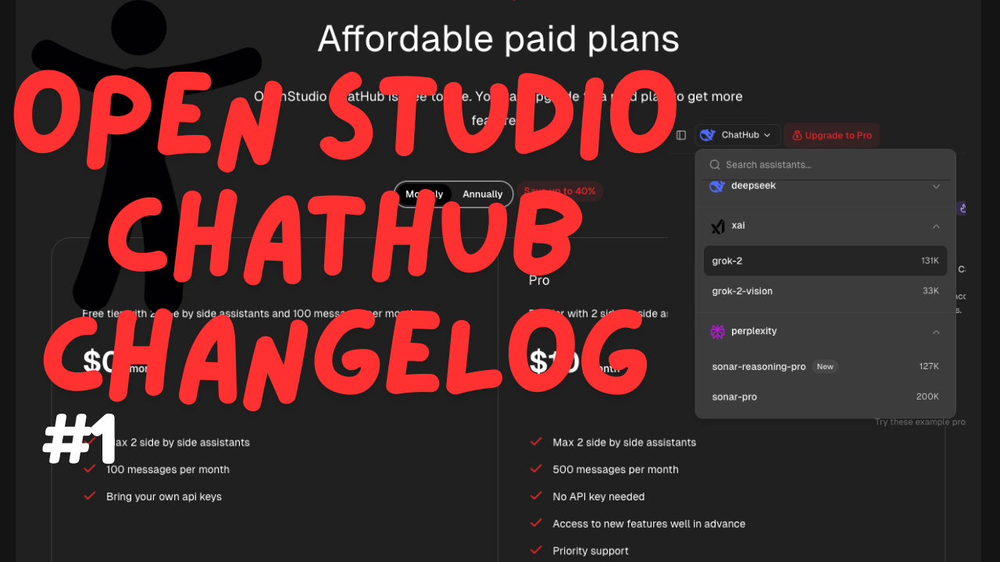
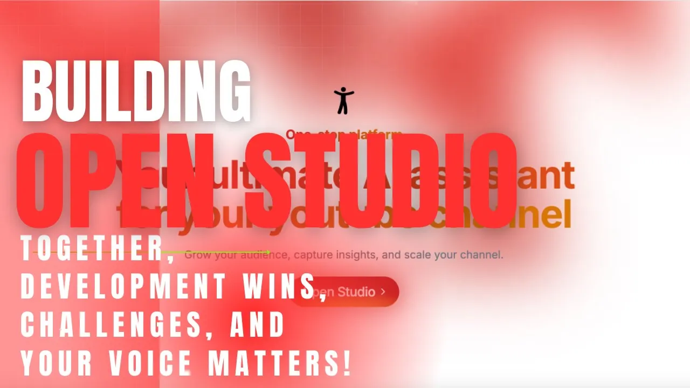

# Open Studio, meet open apps

Open Studio is an open-source AI ecosystem. ChatHub drives research and leverage verticalized agents like OpenStudio Tube to get the work done for YouTube. More niche AI inbound!

## 1. OpenStudio ChatHub

<p align="center">
  
</p>

<p align="center">Where AI conversations take shape.</p>

### Nothing Fancy, Just The Usual Stuff

- 🤖 **Diverse AI Models**: Access multiple language models of all major providers (OpenAI, Anthropic, Google, xAI, Perplexity, Groq, etc).

- 🔧 **Extensible Plugin System**: Unlock new functionalities with an expanding plugin library.

- 🔍 **Real-Time Web Search**: Integrate live web data into conversations.

- ⚡ **Tailored AI Assistants**: Design agents for domain-specific tasks.

- 🎤 **Voice Input**: Speak directly to interact with AI.

- 💾 **Seamless Data Management**: Import/export conversations with ease.

- 📋 **Optimized Prompting**: Utilize curated prompt templates for guided interactions.



## Demo Video

[](https://youtu.be/KCd_bdnJ1SE?si=xJHksV_YNQrA-Wq2)


## 2. OpenStudio Tube - Work In Progress

<p align="center">
  
</p>

<p align="center">Your AI-powered YouTube Studio co-pilot.</p>

🚀 **OpenStudio Tube: The Ultimate AI Assistant for YouTube Creators**  

An open-source beast built to automate and supercharge YouTube Studio.  

### ⚡ **Core Features:**  
📝 **AI-Powered Comment Management** – Auto-moderate, analyze, and reply at scale.  
📈 **Subscriber & Audience Insights** – Know your community, boost engagement.  
🎬 **Smart Video Optimization** – AI-enhanced titles, descriptions, and thumbnails.  
🔊 **AI Subtitle & Dubbing** – Auto-translate for a global reach.  
🚀 **Direct Publishing** – Push content straight to YouTube.  
 

🔥 **First Focus: AI-Driven Comment Management**  
Drowning in comments? Automate replies, moderation, and approvals—saving you **hours**.

💡 **The Vision:** Initially, OpenStudio Tube is designed to be used alongside YouTube Studio. Over time, it will evolve into a full-fledged YouTube Content Management Platform. This is just the beginning. 

## Demo Video

[](https://youtu.be/Z_2XLXBjqzI?si=yVJXvxlf7YHst9oT)

## Built with

- [Next.js](https://nextjs.org/) - Framework
- [Supabase](https://supabase.com/) - Authentication, Database, storage
- [Tailwind CSS](https://tailwindcss.com/) - Styling
- [shadcn/ui](https://ui.shadcn.com/) - UI Components
- [Drizzle ORM](https://orm.drizzle.team/) - Database ORM
- [Tinybird](https://tinybird.co/) - Data Pipeline
- [Upstash](https://upstash.com/) - Cache and Rate Limiting
- [PostHog](https://posthog.com/) - Product Analytics
- [Google Analytics](https://analytics.google.com/) - Web Analytics
- [Resend](https://resend.com/) - Email Delivery
- [React Email](https://react.email/) - Email Templates
- [Lemon Squeezy](https://lemonsqueezy.com/) - Subscription Management
- [AI SDK](https://sdk.vercel.ai/) - AI Toolkit
- [Langchain](https://langchain.com/) - LLM Calls (Just for ChatHub)
- [BetterStack](https://betterstack.com/) - Logging and Monitoring
- [Trigger.dev](https://trigger.dev/) - Background Jobs (Adding soon)
- [Typescript](https://www.typescriptlang.org/) - Type Safety
- [Sentry](https://sentry.io/) - Error Tracking
- [Arcjet](https://arcjet.com/) - Application Security
- [Vercel](https://vercel.com/) - Hosting
- [Turborepo](https://turbo.build/) - Build System

## Getting Started for Developers

### Contributing to the project

### Requirements

- [Node.js](https://nodejs.org/en/) >= 20.0.0
- [pnpm](https://pnpm.io/) >= 9.15.4

### Setup

[Here's a video to be added later](https://youtube.com/@kuluruvineeth) on how to set up the project.

External services required:

- [OpenAI](https://platform.openai.com/api-keys)
- [Anthropic](https://docs.anthropic.com/en/api/getting-started)
- [Groq](https://groq.com/)
- [Gemini](https://aistudio.google.com/)
- [Perplexity](https://docs.perplexity.ai/guides/getting-started)
- [xAI](https://x.ai/api)
- [Supabase](https://supabase.com/)
- [Google OAuth](https://console.cloud.google.com/apis/credentials)
- [Upstash Redis](https://upstash.com/)
- [PostHog](https://posthog.com/)
- [Tinybird](https://www.tinybird.co/)
- [Resend](https://resend.com/)
- [Lemon Squeezy](https://lemonsqueezy.com/)
- [BetterStack](https://betterstack.com/)
- [Trigger.dev](https://trigger.dev/)
- [Sentry](https://sentry.io/)
- [Arcjet](https://arcjet.com/)

We use Postgres for the database.

### Seeding Categories

```bash
bun scripts/seed-categories.ts
```


```bash
Instructions will be added soon to get the project running.
```

### Setting up Google OAuth for Youtube Channel Integration

Enable these scopes in Google Cloud Console:

```plaintext
https://www.googleapis.com/auth/userinfo.profile,
https://www.googleapis.com/auth/userinfo.email,
https://www.googleapis.com/auth/youtubepartner-channel-audit,
https://www.googleapis.com/auth/yt-analytics-monetary.readonly,
https://www.googleapis.com/auth/yt-analytics.readonly,
https://www.googleapis.com/auth/youtubepartner,
https://www.googleapis.com/auth/youtube.force-ssl,
https://www.googleapis.com/auth/youtube.channel-memberships.creator,
https://www.googleapis.com/auth/youtube.upload,
https://www.googleapis.com/auth/youtube,
https://www.googleapis.com/auth/youtube.readonly,
https://www.googleapis.com/auth/youtube.download,
https://www.googleapis.com/auth/youtube.third-party-link.creator
```

### Setting up Tinybird

Follow the instructions [here](./packages/tinybird/README.md) to configure `pipes` and `datasources`.

## Feature Requests

Submit feature requests via [GitHub issues](https://github.com/kuluruvineeth/openstudio-beta/issues).


